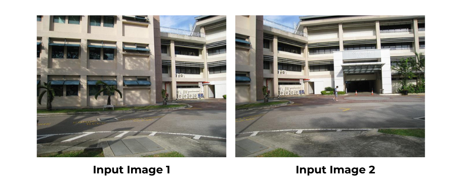
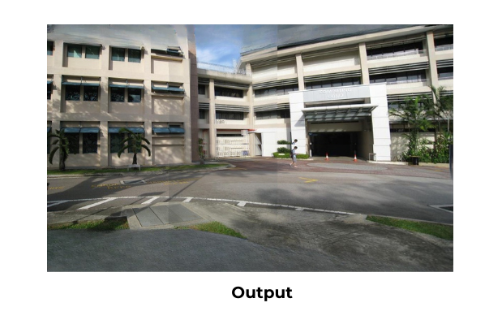

# IM STIN: Image Stitching and Inpainting

This project uses a deep image stitching model that stitches two images based on their features and homographic techniques. Later, it uses an impainting model to 
inpaint the gaps created as a result of warping.

  

<i>The diagram shows a high-level view of the architecture of IM STIN. The <a href="https://github.com/nie-lang/UDIS2/tree/main"> 
  Deep Stitching Model UDIS </a> employs a form of the U-Net model and uses homography techniques. The image in-painting model uses <a href="https://github.com/enesmsahin/simple-lama-inpainting">SimpleLama. </a></i>

 

## Deep Stitching Model UDIS

We use a model of one of the components that stitches the images. The model is available at <a href="https://drive.google.com/file/d/1GBwB0y3tUUsOYHErSqxDxoC_Om3BJUEt/view?usp=sharing"> Google Drive </a>. For more details, please look at <a href="https://github.com/nie-lang/UDIS2/tree/main">  UDIS </a>. Thank you for this open-source model :)

  

## In-painting Model

The inpainting we use is <a href="https://github.com/enesmsahin/simple-lama-inpainting">SimpleLama</a>. It is another open-source model that takes an image and a mask as input. The mask defines the areas that need to be inpainted. Then, Simple Lama uses Fast Fourier Convolution to fill in the gaps.

 

### Creating the Mask
The mask is created using openCV functions. Firstly, the image is converted into grayscale, and then a thresholding function is applied to identify the gaps. The 
mask is generated and stored in the "Mask" folder. 

 

  

<i>The input images</i>

  

<i>The output stitched and unpainted image</i>

## Conclusion

IM STIN successfully integrates deep image stitching and inpainting techniques to seamlessly merge images while filling in missing regions. By leveraging the UDIS deep stitching model, we align and warp images using homographic transformations, ensuring accurate feature-based stitching. The SimpleLama inpainting model then refines the output by intelligently reconstructing gaps, creating a visually coherent final image.

This project highlights the power of deep learning in image processing, particularly in tasks requiring both alignment and restoration.
